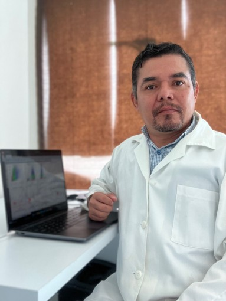

:::: {.columns}

::: {.column width="35%"}

 

::: {.text-center}
[<i class="bi bi-github"></i> GitHub](https://github.com/jvillanuevatoledo) &nbsp; | &nbsp;
[<i class="bi bi-linkedin"></i> LinkedIn](https://www.linkedin.com/in/TU_USUARIO_AQUI) &nbsp; | &nbsp;
[<i class="bi bi-person-vcard"></i> ORCID](https://orcid.org/0000-0001-9532-3678)

[<i class="bi bi-journal-text"></i> ResearchGate](https://www.researchgate.net/profile/TU_PERFIL_AQUI) &nbsp; | &nbsp;
[<i class="bi bi-mortarboard"></i> Google Académico](https://scholar.google.com/citations?user=UjHeR84AAAAJ&hl=es&oi=ao)
:::

:::

::: {.column width="5%"}
<!-- Espacio en blanco -->
:::

::: {.column width="60%"}
Soy especialista en **análisis de datos de citometría de flujo**. 

Especializado en descifrar los mecanismos moleculares del cáncer para desarrollar nuevas estrategias terapéuticas. Mi experiencia abarca desde el diseño experimental y la ejecución de técnicas avanzadas de biología molecular hasta el análisis e interpretación de datos complejos.

A través de **CITOverso**, brindo asesoría científica integral diseñada para investigadores, profesionales y estudiantes que buscan optimizar sus protocolos y flujos de trabajo computacionales.

## Educación

**Doctor en Ciencias en Genética y Biología Molecular**  
*CINVESTAV-IPN unidad Zacatenco*
 
**Maestro en Ciencias en Genética y Biología Molecular**  
*CINVESTAV-IPN unidad Zacatenco* 

**Médico Cirujano**  
*UADY – Facultad de Medicina*

---

## Experiencia profesional

* **Investigador por México de la SECIHTI**  
  *Comisionado al HRAEPY – IMSS BIENESTAR* | 2024 – actualidad

* **Sistema Nacional de Investigadoras e Investigadores (SNII)**  
  *Nivel 1*

---

## Intereses académicos

* Estudio del cáncer
* Biología Molecular
* Medicina traslacional
* Citometría de Flujo
* Bioinformática
* Inteligencia Artificial
:::

::::
---

::: {.text-center}
Hecho con 💙
:::